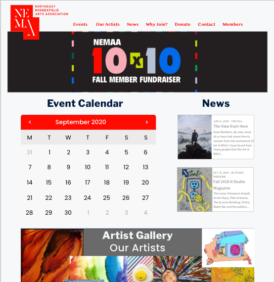

<!DOCTYPE html>
<html lang="en">
<head>
    <meta charset="UTF-8">
    <meta name="viewport" content="width=device-width, initial-scale=1.0">
    <title>Document</title>
    <link a href="css/style.css" type="text/css" rel="stylesheet">    
</head>
<body>
    <section>
        <h1>My Skills</h1>
        

            

                
                <h1>User Research</h1>
                
I find that through participant observation and ethnographic research, we can get a unique understanding of unmet desires before they become pain points 
                

            

            

                
                <h1>UX/UI Prototyping</h1>
                
I apply the insights gathered from thorough User Research to begin assembling the framework for useful and delightful products 

            

            

                
                <h1>Front End Development</h1>
                
One of my biggest passions lies in putting all of the pieces together in a tangible way - taking the concept and bringing it to life for people to interact with and exprience in real time

            

        

    </section>
    <section>
        

            

                
            

                <h4>Hair Goals</h4>
                
We wanted to create a solution for the rampant misinformation and lack of access of haircare products for textured hair and provide a community of people passionate about hair care
                

                <button type="button">This is a Button</button>
            

        

        

            

                
            

            

                <h4>Northeast Minneapolis Arts Association (NEMAA)</h4>
                
We wanted to help NEMAA develop a more useful website to drive profit and promote arts in the Northeast Minneapolis area, and help local artists to better understand NEMAA's events and get the most help they can from the organization
                

                <button type="button">This is a Button</button>
            

        

        

        <h3></h3>
    </section>
</body>
</html>